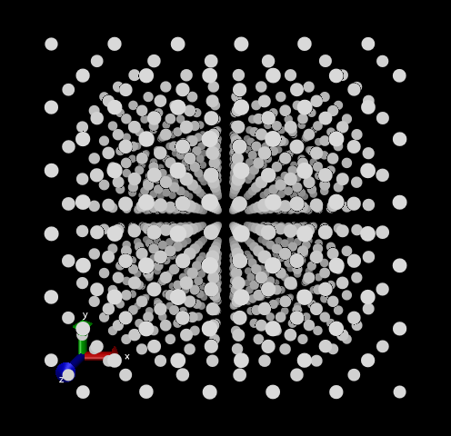
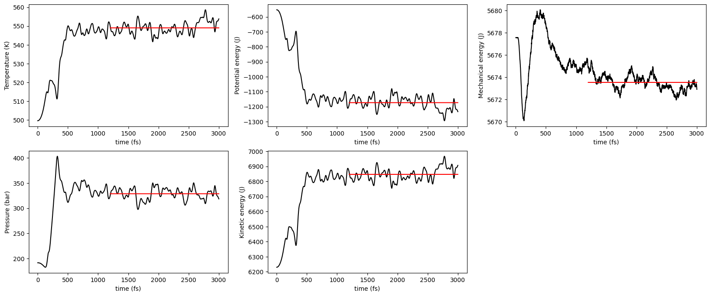
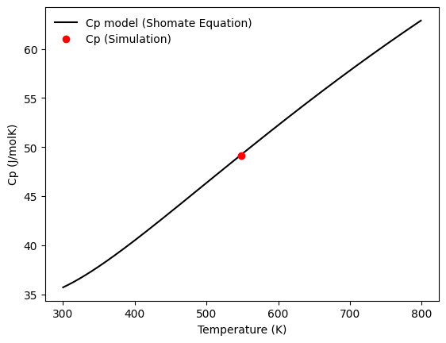

# Molecular Dynamics Simulation in C

This C code performs a simple molecular dynamics simulation of methane molecules in a cubic lattice. The simulation includes calculations for particle interactions, forces, and motion over time.

## Initial condition

The code generates inital coordinates for methane molecules in both a simple cubic, a face-centered cubic, and a body-centered cubic lattice.

## Dynamics

The code utilizes the Lennard-Jones potential to model intermolecular forces between methane molecules. It also incorporates velocity Verlet integration to update particle positions and velocities.

## File Structure

- `main.c`: The main program that reads initial particle configurations from a file (`cfc.xyz`), performs molecular dynamics simulation, and outputs particle positions over time to a file (`movs.xyz`).

- `accel.c`: Contains the `accel` function responsible for calculating the acceleration vectors based on particle interactions.

- `potential.c`: Contains the `potential` function for calculating the Lennard-Jones potential energy.

## Analysis of Molecular Dynamics Simulation Results
This Python analysis utilizes pandas, matplotlib, numpy, and scipy libraries to visualize the results of a molecular dynamics simulation. The simulation data is stored in the 'temper.dat' file, which contains thermodynamic variables over time.

Plots visualize the temporal evolution of temperature, potential energy, mechanical energy, pressure, and kinetic energy. 

The heat capacity (Cp) of methane is calculated with less than 1% of error.

Feel free to adapt the script for your specific needs or extend the analysis as required.